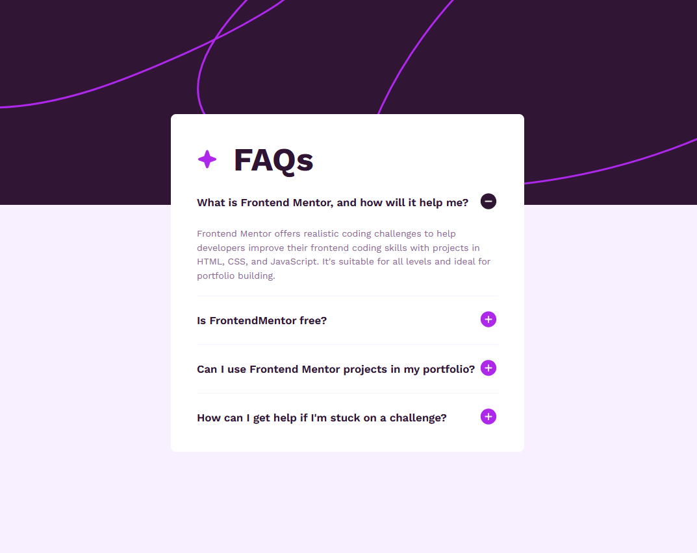

# Frontend Mentor - FAQ accordion solution

This is a solution to the [FAQ accordion challenge on Frontend Mentor](https://www.frontendmentor.io/challenges/faq-accordion-wyfFdeBwBz). Frontend Mentor challenges help you improve your coding skills by building realistic projects.

## Table of contents

- [Overview](#overview)
  - [The challenge](#the-challenge)
  - [Screenshot](#screenshot)
  - [Links](#links)
- [My process](#my-process)
  - [Built with](#built-with)
  - [What I learned](#what-i-learned)
  - [Continued development](#continued-development)
  - [Useful resources](#useful-resources)
- [Author](#author)
- [Acknowledgments](#acknowledgments)

## Overview

### The challenge

Users should be able to:

- Hide/Show the answer to a question when the question is clicked
- Navigate the questions and hide/show answers using keyboard navigation alone
- View the optimal layout for the interface depending on their device's screen size
- See hover and focus states for all interactive elements on the page

### Screenshot



### Links

- [Solution](https://github.com/Sephydev/faq-accordion-js)
- [Live Site](https://sephydev.github.io/faq-accordion-js/)

## My process

### Built with

- Semantic HTML5 markup
- CSS custom properties
- Flexbox
- Mobile-first workflow
- JavaScript Vanilla

### What I learned

In this project, I mainly learn how to do animation with CSS, and how to make the question interactive with the help of JavaScript.
It was really complicated for the animation because it was the first time I'm doing that. I wanted to do a "slide-down/slide-up" effect on the answers depending of if it appears or disappear.

```css
.hidden {
  transition: all 0.5s ease-in-out;
  max-height: 0;
  margin-bottom: 0;
}
```

For JavaScript, I managed to make sure I worked on it once and didn't have to touch it again. It was also complicated but I'm proud of it. My objective was to get all button, all answers and all image, and depending of the id of the button, it change the corresponding answers and images. Thanks to that, I did not have to do one eventListener for each question.

```js
const questionHeader = document.getElementsByClassName("question-header");

Array.prototype.forEach.call(questionHeader, (item) => {
  item.addEventListener("click", function (e) {
    const answers = document.getElementsByClassName("answer");
    const questionImg = document.getElementsByClassName("question-img");

    let id = item.id;
    let isHidden = answers[id].classList.contains("hidden");

    if (isHidden) {
      answers[id].classList.remove("hidden");
      questionImg[id].src = "./assets/img/icon-minus.svg";
    } else {
      answers[id].classList.add("hidden");
      questionImg[id].src = "./assets/img/icon-plus.svg";
    }
  });
});
```

### Continued development

Seeing how it was difficult for me to use CSS animation and JavaScript, I will train more on those domain. Animation make the project really beautiful, and Javascript make it "living", so it will be very interesting if I master those subject.

### Useful resources

- [FJolt Article](https://fjolt.com/article/javascript-multiple-elements-addeventlistener) - This article helped me to put in place my JavaScript. It explain very well how to use addEventListener on multiple elements like an HTMLCollection.
- [MDN Article on transition property](https://developer.mozilla.org/fr/docs/Web/CSS/transition) - This article helped me understand how the transition property work.

## Author

- Frontend Mentor - [@Sephydev](https://www.frontendmentor.io/profile/Sephydev)

## Acknowledgments

Thanks to FJolt team for the creation of an article explaining how to use addEventListener on multiple elements. This unlocked me in my progression during this project.
Thanks to MDN team for creating so many useful article. Those helped me a lot during my learning journey, and keep helping me today !
Thanks to Frontend Mentor for the challenges they make available. Thanks to them, I am learning a lot while having fun reproducing beautiful and interesting design!
